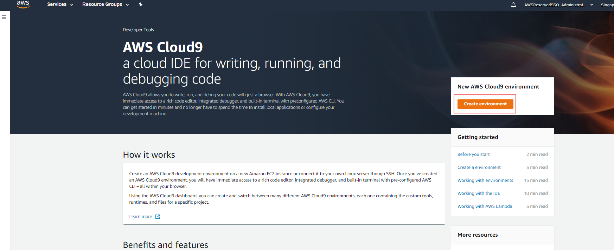
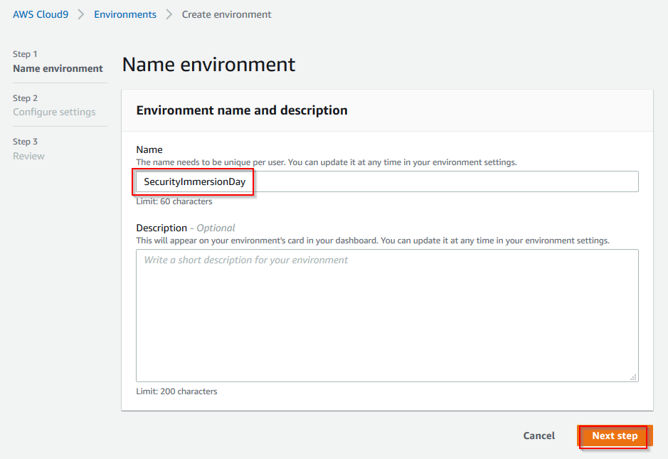
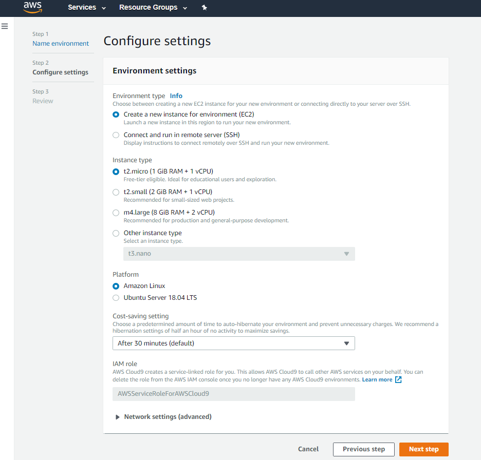
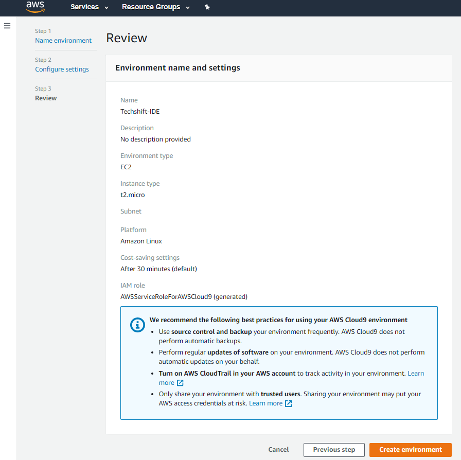
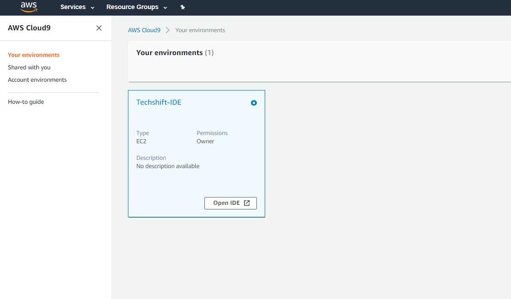
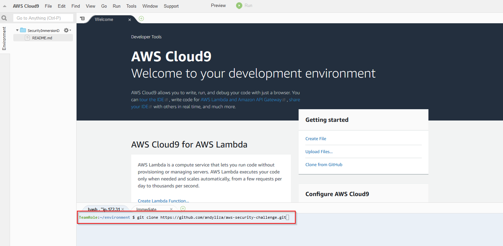
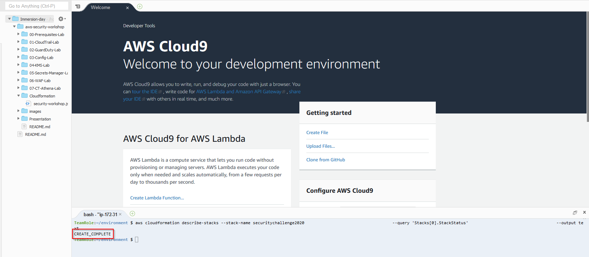

### Create a Cloud9 environment

1) Go to the Cloud9 console and press *Create environment*.



2) Provide a name for your environment - you can name it ___BKKSecurity___



3) Leave all the parameters untouched and press *Next Steps*.





4) Review the settings and press *Create environment*.





5) Now you have an IDE in the cloud.




6) Click on *Open IDE*

7) In the Terminal type teh following commands

```
git clone https://github.com/andyliza/aws-security-challenge.git

```


8) Once the repository is cloned, please depoloy the CloudFormation template using the following command:

```
aws cloudformation create-stack --template-body file://./aws-security-challenge/CloudFormation/security-challenge.json --stack-name bkksecuritychallenge2019 --capabilities CAPABILITY_NAMED_IAM --parameters ParameterKey=InstanceType,ParameterValue=t2.small ParameterKey=KeyName,ParameterValue=TechShift-KeyPair ParameterKey=RDSPassword,ParameterValue=techshift2019 ParameterKey=RDSUsername,ParameterValue=admin ParameterKey=VPCCIDR,ParameterValue=172.4.0.0/16

```

9) Once the installation begins you can check the status of the deployement using this command:

```
aws cloudformation describe-stacks --stack-name bkksecuritychallenge2019 \
                                   --query 'Stacks[0].StackStatus'
                                   --output text
```



 **:heavy_exclamation_mark: DO NOT move past this point until you see CREATE_COMPLETE as the status for your CloudFormation stack**

[Go back](/../../)
