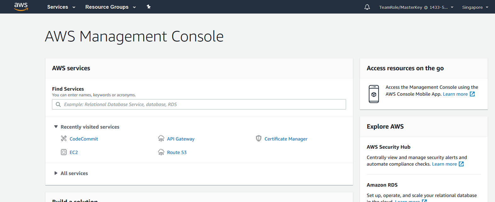

# AWS Security Challenge

## Security Challenge for AWS Immersion Day

You are the CISO of the company Unicorn Travels and you have been tasked by the CEO to secure your e-commerce application.

There are 10 mistakes that have made their way in the architecture and AWS account configuration and you need to remediate them immediately. You recently participated in a AWS Immersion Day
and you learned the basic Security Best practices that go into an AWS Account.

Document and fix this this security breaches and the CEO will reward you with an amazing prize :).

## What do you need to do?

Find the security gaps in the infrastructure deployed in the [Prerequisites Section](./00-Prerequisites-Lab/README.md)

The security gaps are related to:
- architecture
- configurations
- authentication

## How to login to your lab environment via Event Engine

Before starting the labs yo will receive a hash key to access your AWS environment. You will key in this hash key in Event Engine.

Event Engine address: https://dashboard.eventengine.run/login

Set up your team name if you wish. To access te console click on __AWS Console__

After that click on __Open Cosole__

You will see the AWS Console opening up

